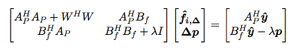
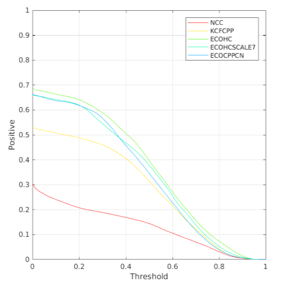
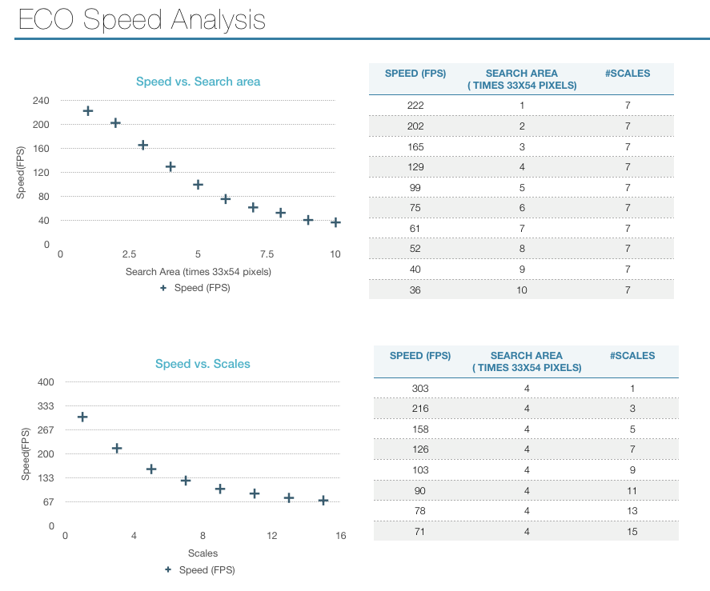

<p align="center">
    
</p>

# What is OpenTracker?
OpenTracker is an open sourced repository for Visual Tracking. It's written in C++, high speed, easy to use, and easy to be implemented in embedded system.
```diff
- AND this is not only boring Codes, 
+ It also has Maths and Implement Notes!
```
If you don't exactly know what this means:

<p align="center">
    
</p>

**Don't worry**, it will be explained fully in the [Notes](https://github.com/rockkingjy/OpenTracker/tree/master/notes). All the maths details of the Not-that-easy algorithms are explaned fully from the very beginning. If **you have headache of reading the papers**(as most of us have), this is a good tutorial. 
(Check [Notes](https://github.com/rockkingjy/OpenTracker/tree/master/notes)(draft now)). 

Or, **if you have problems with the implementation of a complicate cutting-edge algorithms, check this! You will get something!**

<p align="center">
    
</p>
<p align="center">
    
</p>

**Attention!** OpenTracker is **NOT** designed just for tracking human beings as the demo images, it can track **everything**, even some special points!

**For Multiple Object Tracker**, check: [OpenMultiTracker](https://github.com/rockkingjy/OpenMultiTracker).


**2018/11/06 -- New features** add CMake compile support for ECO tracker. (Thanks to [ou-zhi-hui](https://github.com/ou-zhi-hui/OpenTracker))

**2018/09/19 -- New features** Performance tested on VOT2017 dataset!

**2018/09/13 -- New features** CN feature added!

**2018/08/30 -- New features** Support Initialize by Object Detection using [Darknet](https://github.com/rockkingjy/darknet) and track.

**2018/08/27 -- New features** Support ECO API.

**2018/08/24 -- New features** Now ECO runs "almost" real-time on Raspberry Pi 3!

**2018/08/24 -- New features** Support [FFTW](http://www.fftw.org/).

**2018/08/13 -- New features** Speed up by multi-thread.

**2018/08/09 -- New features** Now it supports **Raspberry Pi 3**, and speed up with NEON!

**2018/08/08 -- New features** Speed up with NEON, speed up from ~32FPS to ~42FPS on Jetson TX2 with scale one.

**2018/08/06 -- New features** Speed up with SSE, speed up from ~86FPS to ~102FPS(quicker than matlab version) with scale one.

**2018/07/07 -- New features** OpenTracker Implement Notes draft published! Check **notes/OpenTrackerNotes.pdf**. Complete version is comming!

**2018/07/06 -- New features** Now it supports **Nvidia Jetson TX1/2**!

**2018/07/05 -- New features** Now it supports **macOS**!

**2018/06/28 -- New features** Now it supports automatic initialization with Web camera using **OpenPose**!


## Supported tracker (more in progressing):
Included                                   | Tracker    
-------------------------------------------|---------------
:ballot_box_with_check:                    | CSK          
:ballot_box_with_check:                    | KCF          
:ballot_box_with_check:                    | DSST          
:ballot_box_with_check:                    | GOTURN         
 :hammer:                    | ECO         

## Supported Dataset (more in progressing):

Included                                   | Dataset      | Reference
-------------------------------------------|--------------|-----------
:ballot_box_with_check:                    | VOT-2017     | [Web](http://votchallenge.net/vot2017/dataset.html)
:ballot_box_with_check:                    | TB-2015      | [Web](http://cvlab.hanyang.ac.kr/tracker_benchmark/index.html)
:ballot_box_with_check:                    | TLP          | [Web](https://amoudgl.github.io/tlp/)
:ballot_box_with_check:                    | UAV123       | [Web](https://ivul.kaust.edu.sa/Pages/Dataset-UAV123.aspx)

## Supported Autodetection with Web Camera
Included                                   | Dataset    | Reference
-------------------------------------------|--------------|-----------
:ballot_box_with_check:                    | OpenPose     | [Web](https://github.com/CMU-Perceptual-Computing-Lab/openpose)

## Tested Operating Systems / Platform
Included                   | OS / Platform   
---------------------------|-------------
:ballot_box_with_check:    | Ubuntu 16.04
:ballot_box_with_check:    | macOS Sierra
:ballot_box_with_check:    | NVIDIA Jetson TX1/2
:ballot_box_with_check:    | Rasperberry PI 3 
 :hammer:                  | Windows10

## Performance Analysis
<p align="center">
    
</p>

"ECOHCMATLAB" is the original matlab full version ECO-HC.

"ECOHCMATLABHOGCN" is the matlab version ECO-HC without fDSST scale filter.

"ECOHCMATLABHOG" is the matlab version ECO-HC without fDSST scale filter and CN feature.

"ECOCPPHOGCN" is the c++ ECO tracker in OpenTracker without fDSST scale filter.

"ECOCPPHOG" is the c++ ECO tracker in OpenTracker without CN feature and fDSST scale filter.

"KCFCPP" is the c++ KCF tracker in OpenTracker.

"NCC" is a demo tracker in vot-toolkit.

The test is on dataset VOT2017, and parameters are set exactly the same as "VOT2016_HC_settings" in matlab version. This is just for proof of validation of c++ version code, thus the parameters are not tuned for VOT2017.

You can see from the plot that, full-featured "ECOHCMATLAB" has the highest performance, "ECOCPPHOGCN" has almost the same performance with "ECOHCMATLABHOGCN", and "ECOCPPHOG" quite similar to "ECOHCMATLABHOG". And "KCFCPP" perform even better than the HOG-only ECO version, so it seems that CN feature matters.

## Speed-up(without CN feature)
Included                | Method(single thread)   | FPS(scale=1) | FPS(scale=7)
------------------------|-------------------------|--------------|-------------
:ballot_box_with_check: | Matlab ECO-HOG(Intel i9)| ~73          | ~45
:ballot_box_with_check: | no speed-up(Intel i9)   | ~86          | ~36
:ballot_box_with_check: | SSE(Intel i9)           |~260:cherries:| ~95:cherries:
:ballot_box_with_check: | no speed-up(MacBook Air Intel i5)| ~60        | ~22 
:ballot_box_with_check: | SSE(MacBook Air Intel i5)|~140:cherries:|~55:cherries:
:ballot_box_with_check: | no speed-up(Jestson TX2)| ~32          | ~10
:ballot_box_with_check: | NEON(Jetson TX2)        | ~60:cherries:| ~34:cherries:
:ballot_box_with_check: | no speed-up(Raspberrypi)| ~11          | ~3
:ballot_box_with_check: | NEON(Raspberrypi)       | ~24:cherries:| ~7.5
:hammer:                | GPU                     | :hammer:     | :hammer:

## Speed Analysis(without CN feature)
<p align="center">
    
</p>

# Quick start
--------------------------------
With quick start, you can have a quick first taste of this repository, without any panic. No need to install Caffe, CUDA etc. (**But of course you have to install OpenCV 3.0 first**).

OpenCV 3.0 Install on Ubuntu check this [[Tutorial](https://www.learnopencv.com/install-opencv3-on-ubuntu/)].

## Quick Run ECO Tracker:
In `eco/runecotracker.cc`, make sure to choose the dataset `Demo`:
``` 
    string databaseType = databaseTypes[0];
```
### Quick start -- Ubuntu
```
git clone https://github.com/rockkingjy/OpenTracker
cd OpenTracker/eco
make -j`nproc`
sudo make install
./runecotracker.bin
```
### Quick start -- macOS
```
brew install tesseract
git clone https://github.com/rockkingjy/OpenTracker
cd OpenTracker/eco
make  -j`nproc`
sudo make install
./runecotracker.bin
```

## Quick Run KCF and DSST Tracker:
In file `kcf/runkcftracker.cc`, make sure to choose the dataset `Demo`:
``` 
    string databaseType = databaseTypes[0];
```
### Quick start -- Ubuntu
```
git clone https://github.com/rockkingjy/OpenTracker
cd OpenTracker/kcf
make 
./runkcftracker.bin
```
### Quick start -- macOS
```
brew install tesseract
git clone https://github.com/rockkingjy/OpenTracker
cd OpenTracker/kcf
make
./runkcftracker.bin
```

## Quick Run (almost) all the tracker:
```
git clone https://github.com/rockkingjy/OpenTracker
cd OpenTracker
make 
sudo make install
./trackerscompare.bin
```

# Compile and Run 
--------------------------------
For the **environment settings** and detailed procedures (with all the packages from the very beginning), refer to: [[My DeeplearningSettings](https://github.com/rockkingjy/DeepLearningSettings)].

The only extra-package is: **Opencv3.x** (already installed if you follow the environment settings above).

Of course, for trackers that use Deep features, you need to install [[**caffe**](https://github.com/rockkingjy/caffe)] (maybe I will use Darknet with C in the future, I like Darknet :lips: ), and change the **makefile** according to your path. Compile of caffe refer to : [[Install caffe by makefile](https://github.com/rockkingjy/DeepLearningSettings/blob/master/caffe.md)].

If you want to autodetection the people with web camera, you need to install [[OpenPose](https://github.com/CMU-Perceptual-Computing-Lab/openpose)]. 


## Parameters setting
If you want to use Openpose, in `./makefile`, set `OPENPOSE=1`, else set `OPENPOSE=0`.

Change the datasets, in `inputs/readdatasets.hpp`, change the number of `string databaseType = databaseTypes[1];`

Change the path of datasets, in `inputs/readdatasets.cc`, change the `path` to your path of data.

## To use web camera with openpose
By raising your two arms higher than your nose, it will atomatically detect the person and start the tracking programme.


## Run to compare all the trackers at the same time
```
make all
sudo make install
./trackerscompare.bin
```

## Run ECO
### Compile without Caffe
If you don't want to compile with Caffe, that means you cannot use Deep features, set in **eco/makefile**: `USE_CAFFE=0`.

If you don't want to compile with CUDA, that means you cannot use Deep features, set in **eco/makefile**: `USE_CUDA=0`.

### Compile with Caffe
If you want to compile with Caffe, set in **makefile** and **eco/makefile**: `USE_CAFFE=1 USE_CUDA=1`, and set the according caffe path of your system in **eco/makefile**:
```
CAFFE_PATH=<YOUR_CAFFE_PATH>
```

Download a pretrained [[VGG_CNN_M_2048.caffemodel (370 MB)](https://drive.google.com/file/d/1-kYYCcTR7gBZyHM5oVChNvu0Q9XPdva3/view?usp=sharing)], put it into folder: **eco/model**

If you could not download through the link above (especially for the people from Mainland China), check this [[link](https://gist.github.com/ksimonyan/78047f3591446d1d7b91#file-readme-md)] and download. 

In **eco/parameters.hpp**, change the path to your path:
```
struct CnnParameters
{
	string proto = "<YOUR_PATH>/OpenTracker/eco/model/imagenet-vgg-m-2048.prototxt";
	string model = "<YOUR_PATH>/OpenTracker/eco/model/VGG_CNN_M_2048.caffemodel";
	string mean_file = "<YOUR_PATH>/OpenTracker/eco/model/VGG_mean.binaryproto";
```

### Use CN feature
In **eco/runecotracker.cc**, change the path:
```
    parameters.useCnFeature = true;
    parameters.cn_features.fparams.tablename = "<YOUR_PATH>/OpenTracker/eco/look_tables/CNnorm.txt"
```

### Speed-up with SIMD
If you are using Intel computer, in `eco\makefile`, set:
```
USE_SIMD=1
```
If you are using ARM like Jetson TX1/2, in `eco\makefile`, set:
```
USE_SIMD=2
```
If you are using ARM like Rasberrypi 3, in `eco\makefile`, set:
```
USE_SIMD=3
```

### Speed-up with multi-thread
In `eco\makefile`, set:
```
USE_MULTI_THREAD=1
```

### Speed-up with GPU (not yet implemented)
If you have a GPU, it can speed-up with gpu.

First don't forget to install Opencv with CUDA supported:
```
cmake -D OPENCV_EXTRA_MODULE_PATH=/media/elab/sdd/Amy/opencv_contrib/modules \
    -D CMAKE_BUILD_TYPE=RELEASE \
    -D CMAKE_INSTALL_PREFIX=/usr/local \
    -D CMAKE_BUILD_TYPE=RELEASE \
    -D CMAKE_INSTALL_PREFIX=/usr/local \
    -D WITH_CUDA=ON \
    -D ENABLE_FAST_MATH=1 \
    -D CUDA_FAST_MATH=1 \
    -D WITH_CUBLAS=1 \
    ..
make -j`nproc` 
sudo make install
```
in `eco/makefile`, set:
```
USE_CUDA=1
```

### Datasets settings
Change the path of your test images in **eco/runecotracker.cc**.

Change the datasets, in **eco/runecotracker.cc**, change the number of `string databaseType = databaseTypes[1];`.

### Show heatmap
If you want to show the heatmap of the tracking, in **eco/parameters.cc**, change to `#define DEBUG 1`.

### Compile and Run:
```
cd eco
make -j`nproc`
./runecotracker.bin
```

## Run Opencv trackers
Change the path of your test images in **kcf/opencvtrackers.cc**.
```
cd opencvtrackers
make 
./opencvtrackers.bin
```

## Run KCF / DSST
Change the path of your test images in **kcf/runkcftracker.cc**.
```
cd kcf
make -j`nproc`
./runkcftracker.bin
```

## Run GOTURN
Change the path of your test images in **goturn/rungoturntracker.cc**.

### Pretrained model
You can download a pretrained [[goturun_tracker.caffemodel (434 MB)](https://drive.google.com/file/d/1uc9k8sTqug_EY9kv1v_QnrDxjkrTJejR/view?usp=sharing)], put it into folder: **goturn/nets**

```
cd goturn
make -j`nproc`
./rungoturntracker.bin
```

### Run caffe classification for simple test
```
./classification.bin   /media/elab/sdd/caffe/models/bvlc_reference_caffenet/deploy.prototxt   /media/elab/sdd/caffe/models/bvlc_reference_caffenet/bvlc_reference_caffenet.caffemodel   /media/elab/sdd/caffe/data/ilsvrc12/imagenet_mean.binaryproto   /media/elab/sdd/caffe/data/ilsvrc12/synset_words.txt   /media/elab/sdd/caffe/examples/images/cat.jpg
```

## Run all trackers
**ATTENTION!** Make sure that the parameter settings in `makefile` and `eco/makefile` are the same, else it will be errors!

# How to use the API of the OpenTracker?
To use the API of the trackers is really simple, just two steps. Check `example/readme.md`.

# References 
--------------------------------
(not complete, tell me if I forgot you)

## GOTURN Tracker
**[Learning to Track at 100 FPS with Deep Regression Networks](http://davheld.github.io/GOTURN/GOTURN.html)**,
<br>
[David Held](http://davheld.github.io/),
[Sebastian Thrun](http://robots.stanford.edu/),
[Silvio Savarese](http://cvgl.stanford.edu/silvio/),
<br>
European Conference on Computer Vision (ECCV), 2016 (In press)

## KCF Tracker
J. F. Henriques, R. Caseiro, P. Martins, J. Batista,   
"High-Speed Tracking with Kernelized Correlation Filters", TPAMI 2015.

## CSK Tracker
J. F. Henriques, R. Caseiro, P. Martins, J. Batista,   
"Exploiting the Circulant Structure of Tracking-by-detection with Kernels", ECCV 2012.

## ECO Tracker
Martin Danelljan, Goutam Bhat, Fahad Khan, Michael Felsberg.  
<a href="https://arxiv.org/abs/1611.09224">ECO: Efficient Convolution Operators for Tracking</a>.  
In Proceedings of the IEEE Conference on Computer Vision and Pattern Recognition (CVPR), 2017. 

## C-COT Tracker
Martin Danelljan, Andreas Robinson, Fahad Khan, Michael Felsberg.  
    Beyond Correlation Filters: Learning Continuous Convolution Operators for Visual Tracking.  
    In Proceedings of the European Conference on Computer Vision (ECCV), 2016.  
    http://www.cvl.isy.liu.se/research/objrec/visualtracking/conttrack/index.html
    
## SRDCF Tracker
Martin Danelljan, Gustav Häger, Fahad Khan, Michael Felsberg.  
    Learning Spatially Regularized Correlation Filters for Visual Tracking.  
    In Proceedings of the International Conference in Computer Vision (ICCV), 2015.  
    http://www.cvl.isy.liu.se/research/objrec/visualtracking/regvistrack/index.html

## SRDCF-Deep Tracker
Martin Danelljan, Gustav Häger, Fahad Khan, Michael Felsberg.  
    Convolutional Features for Correlation Filter Based Visual Tracking.  
    ICCV workshop on the Visual Object Tracking (VOT) Challenge, 2015.  
    http://www.cvl.isy.liu.se/research/objrec/visualtracking/regvistrack/index.html
	
## DSST Tracker
Martin Danelljan, Gustav Häger, Fahad Khan and Michael Felsberg.  
    Accurate Scale Estimation for Robust Visual Tracking.  
    In Proceedings of the British Machine Vision Conference (BMVC), 2014.  
    http://www.cvl.isy.liu.se/research/objrec/visualtracking/scalvistrack/index.html
    

Martin Danelljan, Gustav Häger, Fahad Khan, Michael Felsberg.  
    Discriminative Scale Space Tracking.  
    Transactions on Pattern Analysis and Machine Intelligence (TPAMI), 2017.  
    http://www.cvl.isy.liu.se/research/objrec/visualtracking/scalvistrack/index.html

## HOG feature
N. Dalal and B. Triggs.  
    Histograms of oriented gradients for human detection.  
    In CVPR, 2005. 

## Color Names feature
J. van de Weijer, C. Schmid, J. J. Verbeek, and D. Larlus.  
    Learning color names for real-world applications.  
    TIP, 18(7):1512–1524, 2009.  

## OBT database
 Y. Wu, J. Lim, and M.-H. Yang.  
    Online object tracking: A benchmark.  
    TPAMI 37(9), 1834-1848 (2015).  
    https://sites.google.com/site/trackerbenchmark/benchmarks/v10

 Y. Wu, J. Lim, and M.-H. Yang.  
    Object tracking benchmark.  
    In CVPR, 2013.  

## VOT database
http://votchallenge.net/


## Some code references

KCF: [joaofaro/KCFcpp](https://github.com/joaofaro/KCFcpp).

DSST: [liliumao/KCF-DSST](https://github.com/liliumao/KCF-DSST), the max_scale_factor and min_scale_factor is set to 10 and 0.1 in case of divergence error (Tested on UAV123 dataset when the object is quite small, ex.uav2/3/4...).

GOTURN: [davheld/GOTURN](https://github.com/davheld/GOTURN).

ECO: [martin-danelljan/ECO](https://github.com/martin-danelljan/ECO).


